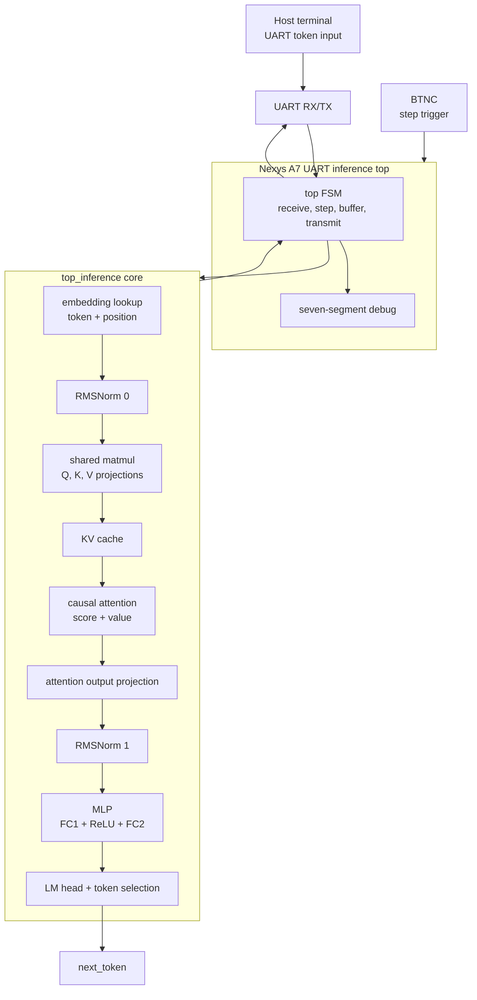

# Inference FPGA

## Architecture

This project is a hardware implementation of a small character-level MicroGPT inference core on a Nexys A7 FPGA. The design uses a hand-written SystemVerilog control FSM around modular datapath blocks for embedding lookup, RMSNorm, matrix multiplication, causal attention, MLP computation, final token scoring, and UART-based host communication. The model runs with signed Q4.12 fixed-point data and uses a persistent KV cache so each inference step writes the current token's K/V vectors and attends over the cached context.



The FPGA top currently works in a debug-step mode: the host sends one initial token over UART, then each BTNC press launches one inference step. The first step clears the KV cache and starts at position 0; later steps feed the previous `next_token` back into the core and increment `pos_id`. When the core reaches BOS/EOS or the 16-token context limit, the buffered generated tokens are sent back to the host over UART.

| Module | Role |
|---|---|
| `nexys_a7_uart_inference_top` | Board-level wrapper: UART receive/transmit, button stepping, result buffering, seven-segment debug |
| `top_inference` | Main transformer inference FSM and datapath integration |
| `embedding_lookup` | Reads token and position embeddings |
| `rmsnorm`, `sqrt_int_fsm` | Fixed-point RMSNorm support |
| `bram_tile_reader`, `matmul_unit` | Shared weight reading and matrix-vector/matrix-matrix compute |
| `attention_score`, `attention_fused` | Causal attention score and value aggregation |
| `kv_cache` | Persistent key/value cache across positions |
| `categorical_weights` | Final token-weight computation and selected-token output |
| `uart_rx`, `uart_tx` | 8-N-1 serial interface |
| `button`, `sevenseg` | Board input synchronization/debug display |

**Model:** 1 transformer block, 4 attention heads, embedding size 16, context length 16, vocabulary size 27 (`a`-`z` plus BOS/EOS token 26). Arithmetic is signed Q4.12 fixed point with 16-bit activations/weights and wider accumulators.

| Parameter | Value |
|---|---:|
| Blocks / heads | 1 / 4 |
| Embedding size | 16 |
| Head dimension | 4 |
| Context length | 16 |
| Vocabulary size | 27 |
| Token width | 5 bits |
| Number format | signed Q4.12 |
| Board top | `nexys_a7_uart_inference_top` |

**Implementation report:** the current Vivado run meets timing on the generated 50 MHz design clock (`clk_out1_clk_wiz_0`, 20 ns period) with WNS = 1.037 ns.

| Resource | Used | Available | Utilization |
|---|---:|---:|---:|
| Slice LUTs | 40,049 | 63,400 | 63.17% |
| Slice Registers | 43,618 | 126,800 | 34.40% |
| Block RAM Tile | 4.5 | 135 | 3.33% |
| DSPs | 135 | 240 | 56.25% |
| Bonded IOB | 37 | 210 | 17.62% |
| BUFGCTRL | 3 | 32 | 9.38% |
| MMCME2_ADV | 1 | 6 | 16.67% |

## File Structure

```text
rtl/             SystemVerilog inference core, UART, button, and seven-segment modules
tb/              focused RTL testbenches
microgpt/        MicroGPT training, export, and Python inference reference scripts
generated/       generated memory files and reference data used by RTL/simulation
scripts/         helper scripts for test data, BRAM files, and UART host I/O
inference_sim/   Vivado project, IP runs, implementation reports, and bitstream output
Nexys-A7-100T-Master.xdc   Nexys A7 board constraints
```

## Build & Run

Prepare or refresh the MicroGPT artifacts:

```bash
cd microgpt
python pipeline/train_and_export.py
python pipeline/generate_input_tokens.py
```

Run the Python fixed-point reference:

```bash
python pipeline/infer_from_weights_q12.py --sample --generate 8
```

Build the FPGA design in Vivado by opening `inference_sim/inference_sim.xpr`, then run synthesis,
implementation, and bitstream generation for `nexys_a7_uart_inference_top`.

After programming the Nexys A7, use the UART helper from the repo root:

```bash
python scripts/uart_token_client.py
```

The host sends one initial token ID. Press BTNC on the FPGA to step inference, and the generated
tokens are returned over UART when the sequence ends.
